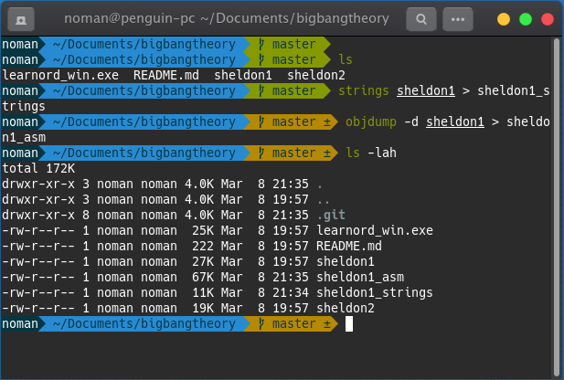
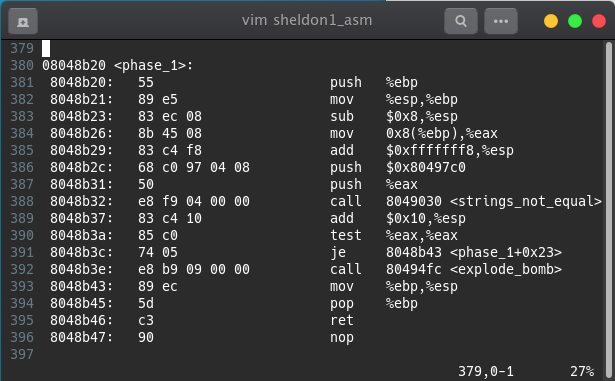
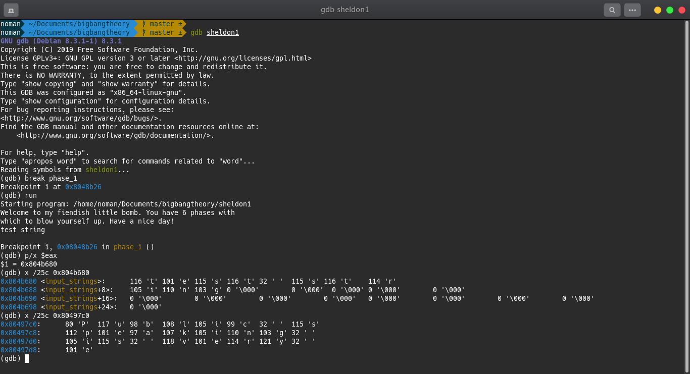
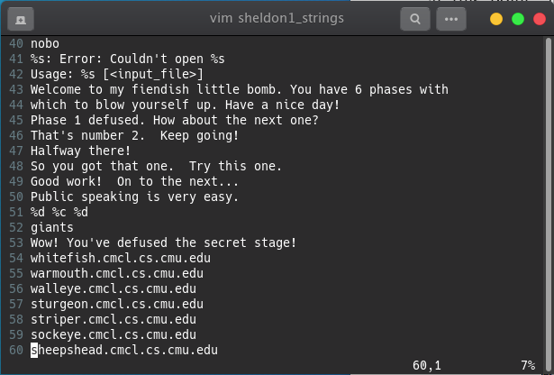
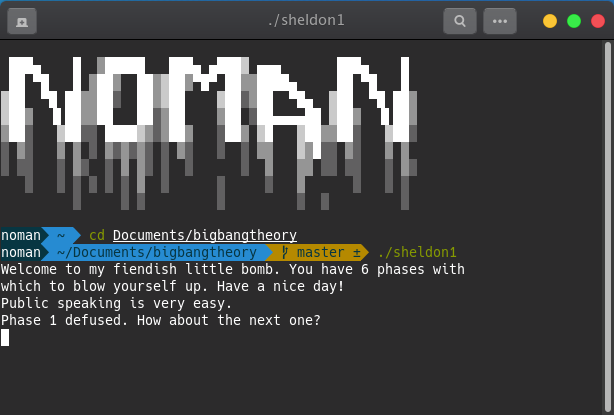

## Sheldon1 Writeup

To get started with sheldon1, first the file permission should be changed for execution and the strings and assembly code can be copied to different files.

### Phase 01

Lets check the assembly code of sheldon1 first. We will analyze the phase_1 section there.

In this section, we can see there are two values pushed onto the stack before calling the funcion <strings_not_equal>. One of the values appears to be stored in **$0x80497c0** location and another one in **$eax** register.

We have to use **gdb** to figure out more about this.
Let'run gdb and break in **phase_1** and run the debugger.
Now, input a string for testing. We got a breakpoint. Find the location $eax and check to confirm about our hypothesis in that particular memory location. Let's see what's the string stored there.

To understand properly we can take help from the strings file saved for the sheldon1.

So, we can clearly understand the string and let's try it out.

Yeah!
We have successfully defused phase1. We have another 5 phases to defuse.
